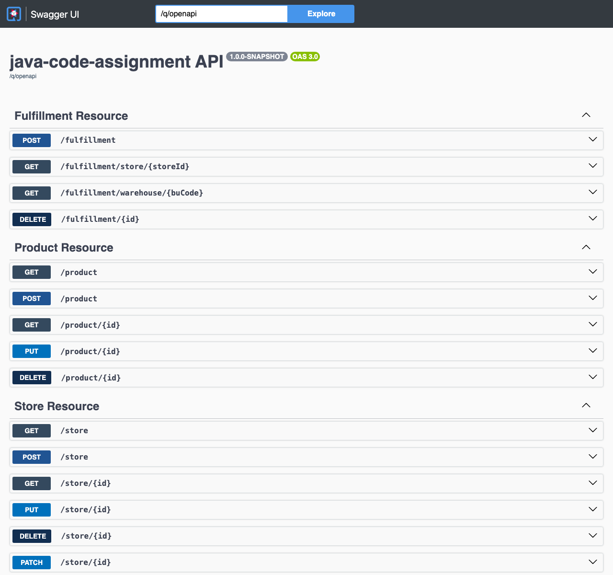
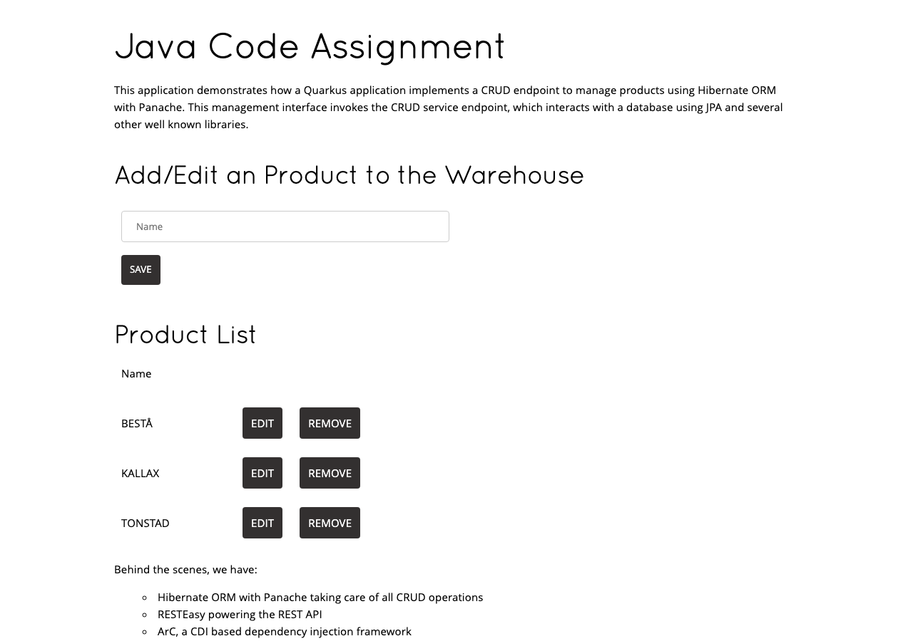
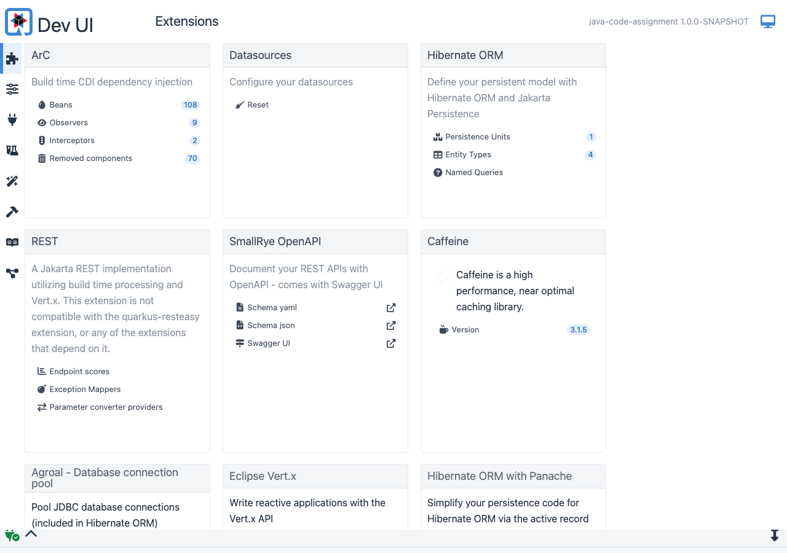

# Fulfillment & Colocation Management Platform

[](https://github.com/atmanishk/FnCS_Casestudy2/actions/workflows/ci.yml)
[](https://adoptium.net)
[](https://quarkus.io)
[](docs/TEST_COVERAGE_REPORT.md)
[](docs/TEST_COVERAGE_REPORT.md)

## Overview

This repository contains my implementation of the **Warehouse, Store, Product, and Fulfillment Colocation Management Platform**. The project is designed with production-grade enterprise standards, applying **Hexagonal Architecture (Ports and Adapters)**, **Domain-Driven Design (DDD)**, transactional safety patterns, and strict separation of concerns.

### Key Highlights & Design Decisions
- **Decoupled Domain Validation**: Extracted validation logic into dedicated, reusable validators (`WarehouseValidator`, `FulfillmentValidator`), ensuring domain use cases and services strictly handle orchestration without mixed responsibilities.
- **Hexagonal Architecture & Domain Purity**: The core `Warehouse` domain entity is a pure POJO decoupled from JPA/Hibernate annotations. Domain ports define storage and location resolution contracts.
- **Clean Transport Mapping**: Implemented `WarehouseResourceMapper` in the REST adapter layer to isolate OpenAPI generated DTOs from internal domain models without fully-qualified class names or leakage.
- **Transactional Consistency**: Solved partial-sync failures by using CDI Transactional Events (`@Observes(during = TransactionPhase.AFTER_SUCCESS)`) to synchronize store state with the legacy system strictly after database commits.
- **Comprehensive Quality Gates**: 116 automated tests with **86.56% line coverage**, enforced by an automated Maven JaCoCo gate (>80%).

---

## Application Showcase

### Interactive Swagger UI (`/q/swagger-ui`)
Interactive OpenAPI 3.0 specification covering all Warehouse, Store, Product, and Fulfillment REST API endpoints:


### Live Web Application (`/index.html`)
Live responsive management interface powered by Panache ORM and PostgreSQL:


### Quarkus Dev UI (`/q/dev-ui`)
Runtime dashboard showing CDI beans, Hibernate ORM entity mappings, REST endpoints, and extensions:


### JaCoCo Code Coverage Report
Automated verification showing **86.56% line coverage** across all packages:


---

## Architecture & Implementation

### 1. Location Resolution (`LocationGateway`)
- Implemented postal identifier resolution adhering to pattern `^[A-Za-z]{3}[0-9]+$` (e.g., `ZWOLLE-001`, `AMSTERDAM-002`).
- Handles case-insensitivity, trim sanitation, format validation, and unknown location edge cases.
- **Test Suite**: [`LocationGatewayTest`](fcs-interview-code-assignment-main/java-assignment/src/test/java/com/fulfilment/application/monolith/location/LocationGatewayTest.java) (5 unit tests).

### 2. Store Transactional Synchronization (`StoreResource` & `StoreSyncObserver`)
- **Problem Fixed**: Prevented inconsistent states where a database commit succeeded while synchronous legacy sync failed, or where legacy sync succeeded while the database transaction rolled back.
- **Solution**: Decoupled legacy sync into CDI transactional events (`StoreCreatedEvent`, `StoreUpdatedEvent`). Handled by `StoreSyncObserver` using `@Observes(during = TransactionPhase.AFTER_SUCCESS)`, guaranteeing legacy system synchronization only triggers after the database transaction has committed.
- **Test Suite**: [`StoreSyncObserverTest`](fcs-interview-code-assignment-main/java-assignment/src/test/java/com/fulfilment/application/monolith/stores/StoreSyncObserverTest.java) and [`StoreEndpointTest`](fcs-interview-code-assignment-main/java-assignment/src/test/java/com/fulfilment/application/monolith/stores/StoreEndpointTest.java).

### 3. Warehouse Hexagonal Architecture (`warehouses`)
- **Domain Layer Purity**: The core domain model `Warehouse` is a clean POJO free of JPA annotations.
- **Domain Ports**: `WarehouseStore` defines domain persistence operations; `LocationResolver` defines location resolution contracts.
- **Dedicated Validator (`WarehouseValidator`)**:
  - Encapsulates attribute validation, BU code uniqueness, location validity, location max warehouse limit, and cumulative capacity checks.
  - Enforces replacement feasibility: stock matching (exact inventory continuity), capacity accommodation, and target location feasibility.
- **Orchestration Use Cases**:
  - `CreateWarehouseUseCase`: Delegates validation to `WarehouseValidator` and persists via `WarehouseStore`.
  - `ReplaceWarehouseUseCase`: Atomically archives the active warehouse and creates the replacement unit with the same business unit code.
  - `ArchiveWarehouseUseCase`: Sets `archivedAt` timestamp for safe soft deletion.
- **Clean REST Adapter**:
  - `WarehouseResourceImpl` implements the contract-first OpenAPI interface.
  - `WarehouseResourceMapper` isolates transport DTOs from domain models cleanly.
  - JAX-RS `ContainerResponseFilter` ensures HTTP 201 Created on POST operations.
- **Test Suites**: [`WarehouseValidatorTest`](fcs-interview-code-assignment-main/java-assignment/src/test/java/com/fulfilment/application/monolith/warehouses/domain/validator/WarehouseValidatorTest.java) (21 tests), [`WarehouseResourceMapperTest`](fcs-interview-code-assignment-main/java-assignment/src/test/java/com/fulfilment/application/monolith/warehouses/adapters/restapi/WarehouseResourceMapperTest.java) (5 tests), [`CreateWarehouseUseCaseTest`](fcs-interview-code-assignment-main/java-assignment/src/test/java/com/fulfilment/application/monolith/warehouses/domain/usecases/CreateWarehouseUseCaseTest.java) (9 tests), [`ReplaceWarehouseUseCaseTest`](fcs-interview-code-assignment-main/java-assignment/src/test/java/com/fulfilment/application/monolith/warehouses/domain/usecases/ReplaceWarehouseUseCaseTest.java) (5 tests), [`ArchiveWarehouseUseCaseTest`](fcs-interview-code-assignment-main/java-assignment/src/test/java/com/fulfilment/application/monolith/warehouses/domain/usecases/ArchiveWarehouseUseCaseTest.java) (3 tests), and [`WarehouseEndpointTest`](fcs-interview-code-assignment-main/java-assignment/src/test/java/com/fulfilment/application/monolith/warehouses/adapters/restapi/WarehouseEndpointTest.java) (12 tests).

### 4. Product-Warehouse-Store Fulfillment (`fulfillment`)
- Introduced a dedicated **Fulfillment Bounded Context** managing network relationships between Products, Stores, and Warehouses.
- **Dedicated Validator (`FulfillmentValidator`)**:
  - Validates input parameters and existence of Store, Product, and Active Warehouse (with 404 responses).
  - Enforces **all 3 strict business constraints**:
    1. **Max 2 Warehouses per Product-Store**: A product at a given store can be fulfilled by at most 2 distinct warehouses.
    2. **Max 3 Warehouses per Store**: A store can be fulfilled by at most 3 distinct warehouses across all products.
    3. **Max 5 Products per Warehouse**: A warehouse can fulfill at most 5 distinct products across the entire network.
- **Service & Endpoints**:
  - `FulfillmentService`: Coordinates validation, idempotency checks, and persistence.
  - `FulfillmentResource`: REST API for assigning, querying by store/warehouse, and removing fulfillments (`/fulfillment/assign`, `/fulfillment/store/{id}`, `/fulfillment/warehouse/{buCode}`).
- **Test Suites**: [`FulfillmentValidatorTest`](fcs-interview-code-assignment-main/java-assignment/src/test/java/com/fulfilment/application/monolith/fulfillment/domain/validator/FulfillmentValidatorTest.java) (17 tests), [`FulfillmentServiceTest`](fcs-interview-code-assignment-main/java-assignment/src/test/java/com/fulfilment/application/monolith/fulfillment/FulfillmentServiceTest.java) (9 tests), and [`FulfillmentEndpointTest`](fcs-interview-code-assignment-main/java-assignment/src/test/java/com/fulfilment/application/monolith/fulfillment/FulfillmentEndpointTest.java) (3 tests).

---

## Written Deliverables

- **Architecture & Technical Decisions**: [`java-assignment/QUESTIONS.md`](fcs-interview-code-assignment-main/java-assignment/QUESTIONS.md)
  - Detailed comparison: Active Record vs. Panache Repository vs. Hexagonal Ports & Adapters.
  - Contract-First (OpenAPI Spec) vs. Code-First API design analysis and enterprise recommendations.
  - Test pyramid prioritization, mutation testing, and maintaining long-term test effectiveness.
- **Enterprise Case Study Analysis**: [`case-study/CASE_STUDY.md`](fcs-interview-code-assignment-main/case-study/CASE_STUDY.md)
  - Scenario 1: Fulfillment cost tracking and Activity-Based Costing (ABC) models.
  - Scenario 2: Cost optimization strategies, intelligent routing, and split-shipment reduction.
  - Scenario 3: Real-time financial ERP integration using the Transactional Outbox Pattern and idempotency keys.
  - Scenario 4: Driver-based budgeting, ML time-series forecasting, and simulation.
  - Scenario 5: Cost control during warehouse replacement, dual-run migrations, and preserving cost histories.
- **Test Coverage Tracking Report**: [`docs/TEST_COVERAGE_REPORT.md`](docs/TEST_COVERAGE_REPORT.md)
  - Complete package-by-package metrics, instruction counts, and branch coverage breakdown.

---

## Quality Metrics & Testing

- **Total Tests**: **116 tests** across 13 test suites (0 failures, 0 errors, 0 skipped).
- **Line Coverage**: **86.56%** (438 / 506 lines) — verified by JaCoCo.
- **Instruction Coverage**: **82.60%** (1,733 / 2,098 instructions).
- **Automated Gate**: `jacoco-maven-plugin:check` configured to fail any build dropping below 80% line coverage.
- **Test Portability**: Automated test suite uses in-memory H2 in PostgreSQL compatibility mode for ultra-fast, dependency-free execution.

---

## Continuous Integration (CI/CD)

The repository includes a GitHub Actions workflow in [`.github/workflows/ci.yml`](.github/workflows/ci.yml) that:
1. Runs on every push and pull request to `main` and `master`.
2. Sets up OpenJDK 21 with Maven caching.
3. Executes `./mvnw clean verify -B`, running all 116 tests and enforcing the JaCoCo >80% coverage check.
4. Archives and publishes JaCoCo HTML reports and Surefire test reports as workflow artifacts.

---

## Getting Started

### Prerequisites
- **Java 21+** (e.g., Eclipse Temurin 21)
- **Maven 3.8+** (or use included `./mvnw`)
- *(Optional for Prod)* Docker / PostgreSQL 13+

### Building & Running Tests
To run the full build, execute all 116 tests, and verify code coverage:
```bash
cd fcs-interview-code-assignment-main/java-assignment
./mvnw clean verify
```

To view the generated JaCoCo coverage report:
```bash
open target/jacoco-report/index.html
```

### Running in Development Mode
```bash
cd fcs-interview-code-assignment-main/java-assignment
./mvnw quarkus:dev
```
Access points:
- Application UI: [http://localhost:8080/index.html](http://localhost:8080/index.html)
- Swagger UI: [http://localhost:8080/q/swagger-ui](http://localhost:8080/q/swagger-ui)
- Dev UI: [http://localhost:8080/q/dev-ui](http://localhost:8080/q/dev-ui)

### Running in Production Mode (PostgreSQL)
1. Start PostgreSQL:
```bash
docker run -it --rm=true --name quarkus_test -e POSTGRES_USER=quarkus_test -e POSTGRES_PASSWORD=quarkus_test -e POSTGRES_DB=quarkus_test -p 15432:5432 postgres:13.3
```

2. Package and run:
```bash
cd fcs-interview-code-assignment-main/java-assignment
./mvnw clean package
java -jar ./target/quarkus-app/quarkus-run.jar
```
