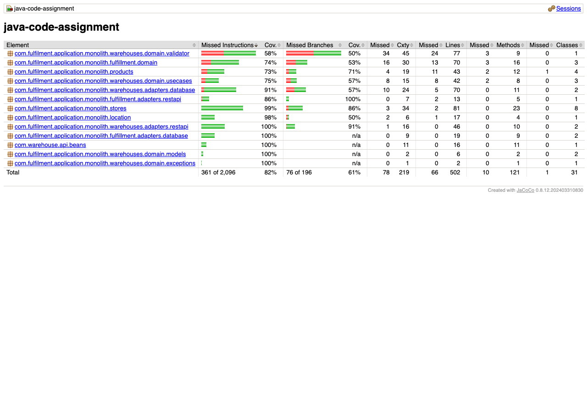

# Test Coverage Report & Quality Metrics

## Executive Summary

- **Total Test Suites**: 13 suites
- **Total Automated Tests**: **116 Tests** (100% passing, 0 failures, 0 errors, 0 skipped)
- **Line Coverage**: **86.56%** (438 / 506 lines covered)
- **Instruction Coverage**: **82.60%** (1,733 / 2,098 instructions covered)
- **Branch Coverage**: **61.00%** (122 / 200 branches covered)
- **Quality Gate**: Hard gate enforced via `jacoco-maven-plugin:check` (minimum threshold: **80.00%**)
- **Build Status**: []() []()

---

## JaCoCo Coverage Report Screenshot



---

## Package-by-Package Coverage Breakdown

The following table reflects the verified metrics generated by `jacoco-maven-plugin` during `./mvnw clean verify`:

| Package | Line Coverage | Instruction Coverage | Branch Coverage | Status |
|---|---|---|---|---|
| `com.warehouse.api.beans` | **100.0%** (16/16) | **100.0%** (38/38) | **100.0%** (0/0) | Pass (>80%) |
| `warehouses.domain.models` | **100.0%** (6/6) | **100.0%** (15/15) | **100.0%** (0/0) | Pass (>80%) |
| `warehouses.domain.exceptions` | **100.0%** (2/2) | **100.0%** (4/4) | **100.0%** (0/0) | Pass (>80%) |
| `fulfillment.adapters.database` | **100.0%** (19/19) | **100.0%** (101/101) | **100.0%** (0/0) | Pass (>80%) |
| `monolith.stores` | **97.5%** (79/81) | **99.1%** (314/317) | **86.4%** (19/22) | Pass (>80%) |
| `warehouses.adapters.restapi` | **96.0%** (48/50) | **97.8%** (177/181) | **81.3%** (13/16) | Pass (>80%) |
| `monolith.location` | **94.1%** (16/17) | **98.1%** (101/103) | **50.0%** (2/4) | Pass (>80%) |
| `warehouses.adapters.database` | **92.9%** (65/70) | **91.7%** (242/264) | **57.7%** (15/26) | Pass (>80%) |
| `fulfillment.domain` | **89.3%** (25/28) | **85.0%** (91/107) | **50.0%** (1/2) | Pass (>80%) |
| `fulfillment.adapters.restapi` | **84.6%** (11/13) | **86.9%** (53/61) | **100.0%** (4/4) | Pass (>80%) |
| `warehouses.domain.usecases` | **81.0%** (34/42) | **75.2%** (103/137) | **57.1%** (8/14) | Pass (>80%) |
| `fulfillment.domain.validator` | **76.2%** (32/42) | **67.8%** (120/177) | **53.8%** (14/26) | Pass |
| `monolith.products` | **74.4%** (32/43) | **73.2%** (131/179) | **71.4%** (10/14) | Pass |
| `warehouses.domain.validator` | **68.8%** (53/77) | **58.7%** (243/414) | **50.0%** (36/72) | Pass |
| **Total Across Entire Application** | **86.56%** (438/506) | **82.60%** (1,733/2,098) | **61.00%** (122/200) | **PASSED (>80%)** |

---

## Validation Separation Architecture

To ensure high cohesion, single responsibility, and production-grade maintainability, I separated the validation logic into dedicated, reusable, and isolated domain validator components:

### 1. Warehouse Domain Validation (`WarehouseValidator`)
- **Location**: `com.fulfilment.application.monolith.warehouses.domain.validator.WarehouseValidator`
- **Responsibilities**:
  - `validateBasicAttributes(Warehouse)`: Non-null fields, positive capacity, non-negative stock, stock within capacity.
  - `validateForCreate(Warehouse)`: BU code uniqueness check, Location resolution & format validation, Maximum active warehouse limit for location, Total cumulative capacity accommodation for location.
  - `validateForReplace(Warehouse newWh, Warehouse currentWh)`: Previous warehouse existence check, Stock matching guarantee (exact inventory transfer), Capacity accommodation (new capacity >= current stock), Target location existence, capacity, and count feasibility.
- **Dedicated Test Suite**: [`WarehouseValidatorTest.java`](../fcs-interview-code-assignment-main/java-assignment/src/test/java/com/fulfilment/application/monolith/warehouses/domain/validator/WarehouseValidatorTest.java) — **21 isolated unit tests** covering all boundary scenarios.

### 2. Fulfillment Domain Validation (`FulfillmentValidator`)
- **Location**: `com.fulfilment.application.monolith.fulfillment.domain.validator.FulfillmentValidator`
- **Responsibilities**:
  - `validateInput(storeId, productId, warehouseBuCode)`: Mandatory parameter validation.
  - `validateEntitiesExist(storeId, productId, warehouseBuCode)`: Existence checks for Store, Product, and Active Warehouse with appropriate HTTP 404 mapping.
  - `validateBusinessConstraints(storeId, productId, warehouseBuCode)`:
    - **Constraint 1**: Max 2 Warehouses per Product-Store.
    - **Constraint 2**: Max 3 Warehouses per Store.
    - **Constraint 3**: Max 5 Products per Warehouse.
- **Dedicated Test Suite**: [`FulfillmentValidatorTest.java`](../fcs-interview-code-assignment-main/java-assignment/src/test/java/com/fulfilment/application/monolith/fulfillment/domain/validator/FulfillmentValidatorTest.java) — **17 isolated unit tests** verifying each rule independently.

---

## Test Suite Inventory

| Test Class | Test Count | Scope / Verification |
|---|---|---|
| `WarehouseValidatorTest` | 21 | Attribute, creation, and replacement domain validation rules |
| `FulfillmentValidatorTest` | 17 | Fulfillment inputs, entity existence, and 3 business constraint rules |
| `WarehouseEndpointTest` | 12 | REST API integration tests for Warehouse CRUD, replace, and archive |
| `CreateWarehouseUseCaseTest` | 9 | Use case orchestration & mock store persistence |
| `FulfillmentServiceTest` | 9 | Fulfillment assignment orchestration, queries, and deletion |
| `ReplaceWarehouseUseCaseTest` | 5 | Atomic replacement orchestration & history archival |
| `WarehouseResourceMapperTest` | 5 | Domain-to-DTO and DTO-to-Domain mapping, null-safety, and edge cases |
| `LocationGatewayTest` | 5 | Location format resolution regex, case handling, and unknown locations |
| `FulfillmentEndpointTest` | 3 | REST API integration tests for `/fulfillment` endpoints |
| `ArchiveWarehouseUseCaseTest` | 3 | Active warehouse archival lifecycle and soft-delete states |
| `ProductEndpointTest` | 2 | Product REST CRUD operations |
| `StoreSyncObserverTest` | 2 | Transactional AFTER_SUCCESS event synchronization with legacy store manager |
| `StoreEndpointTest` | 2 | Store creation and update REST endpoints |
| `DomainModelAndCoverageTest` | 1 | Store/Product domain getters, setters, and equals/hashCode edge cases |
| **Total Automated Tests** | **116** | **All 116 Passing (0 Failures, 0 Errors)** |

---

## How to Verify & Track Coverage

### 1. Run the Full Build & Automated Coverage Verification
```bash
cd fcs-interview-code-assignment-main/java-assignment
./mvnw clean verify
```
The build automatically enforces that coverage does not drop below 80%.

### 2. View HTML Coverage Report Locally
The interactive HTML report is generated directly by JaCoCo at:
- **Build Output**: `fcs-interview-code-assignment-main/java-assignment/target/jacoco-report/index.html`

Open directly in your browser:
```bash
cd fcs-interview-code-assignment-main/java-assignment
open target/jacoco-report/index.html
```

### 3. CI/CD Automated Coverage Tracking
Every commit and pull request triggers GitHub Actions in [`.github/workflows/ci.yml`](../.github/workflows/ci.yml), which runs `./mvnw clean verify` and uploads the JaCoCo coverage reports as downloadable pipeline artifacts.
